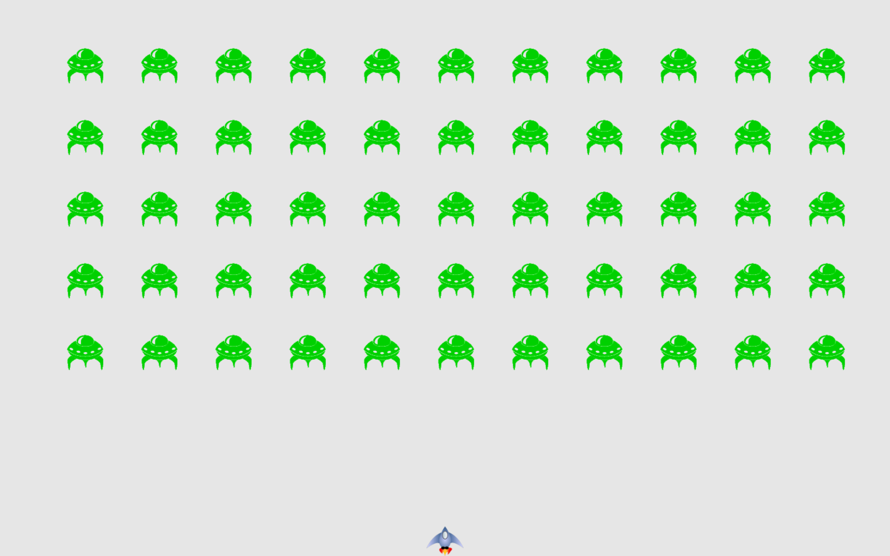

# Alien Invasion game
## Introduction
- This game was written in Python
- Alien Invasion is a project introduced in Python Crash Code by Eric Matthes

## General description
- In Alien Invasion, the player controls a rocket ship that appears at the bottom of the screen
- Move the ship using arrow keys and shoot bullets with spacebar
- A fleet of aliens fills the sky and moves across and down the screen
- When a fleet is destroyed, a faster fleet will appear
- If the ship or the bottom of the screen is touched, player loses on ship in a total of 3
- The game ends when the player loses all ships

## Interface

